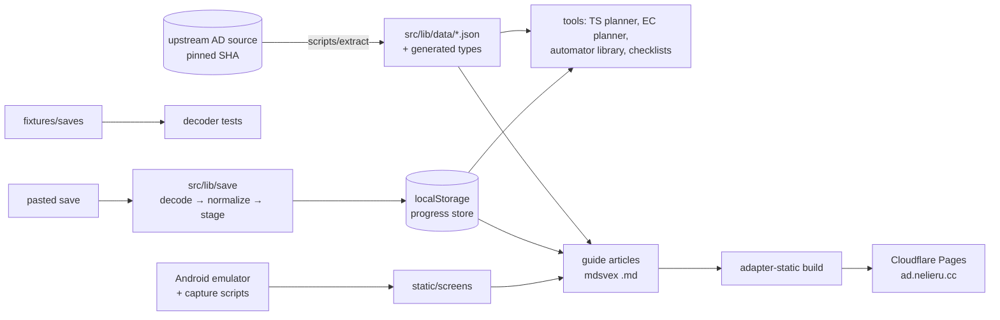

# adg — implementation plan

Decisions: [`PREPLANNING.md`](PREPLANNING.md). This plan only orders the work and fixes the shared contracts.

## Architecture

## Shared contracts

- **Stage model.** `src/lib/stages.ts` holds an ordered `Stage` id list modeled on upstream `progress-checker.js`. Every article, checklist item, and tool declares the stage it belongs to.
- **Normalized save.** `src/lib/save` returns one `NormalizedSave` (upstream schema facts: counters as `Decimal`-like `{m, e}`, achievement set, challenge sets, unlocks). Both the native-Android and web/steam envelopes decode into it.
- **Game data.** `scripts/extract` writes JSON plus `.d.ts` files to `src/lib/data/generated/` from the upstream pin. Consumers import typed JSON only and never evaluate upstream code at runtime.
- **Articles.** `src/content/<milestone>/<slug>.md` with frontmatter `{ title, stage, order, verified: { android, upstream } }`. Shared components (`Callout`, `Screen`, `StageGate`, `Num`) live in `src/lib/components`.
- **Progress store.** `src/lib/progress.svelte.ts` is a rune-based store persisted to localStorage. It holds the stage (from an import or picked manually), checklist ticks, and planner state.

## Order of work

1. **Foundation:** scaffold, mdsvex spike, extractor, decoder, app shell, emulator pipeline, first deploy. Each is committed separately.
2. **Tools** (parallel once the contracts exist): save import UI, checklists, TS planner, EC planner, automator library.
3. **Content:** Milestone 1 (Pre-Infinity → first Reality), then Milestone 2 (Celestials → END). Each article is checked against the upstream source and screenshots.
4. **Ship:** offline service worker, end-to-end checks on a mobile viewport, production deploy.

## Verification rules

- The decoder must decode and stage every fixture, and the paired fixture must normalize identically from both envelopes.
- Extractor output must be deterministic; bumping the upstream pin produces a reviewable diff.
- Every automator script is run in the emulator before it ships.
- Every UI change is checked in a real browser at a phone viewport.
